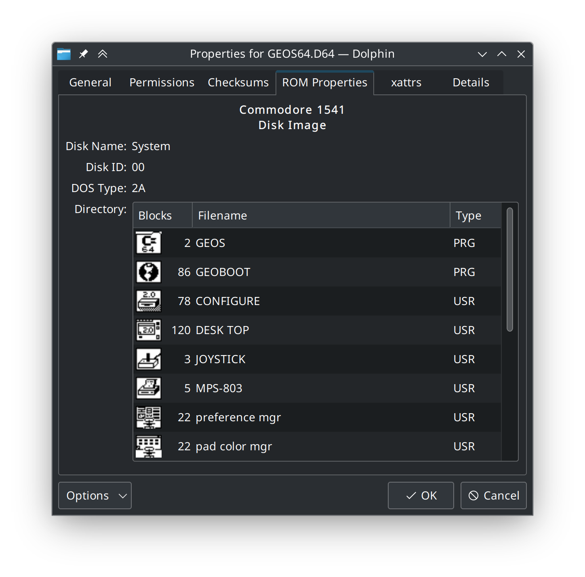

# ROM Properties Page shell extension

This shell extension adds a few nice features to file browsers for managing
video game ROM and disc images.

[](https://www.gnu.org/licenses/old-licenses/gpl-2.0.en.html)
[](https://ci.appveyor.com/project/GerbilSoft/rom-properties/branch/master)<br>
[](https://scan.coverity.com/projects/10146)
[](https://crowdin.com/project/rom-properties)<br>
[](https://github.com/GerbilSoft/rom-properties/actions/workflows/codeql-analysis.yml)
[](https://www.codefactor.io/repository/github/gerbilsoft/rom-properties/overview)
[](https://codecov.io/gh/GerbilSoft/rom-properties)

## v2.3



Major changes in v2.3 include:

* xattrs tab on Linux now shows XFS attributes.

* rpcli now supports extracting mipmap levels from most supported texture formats.
  * Mipmaps are now supported for DirectDrawSurface and KhronosKTX.

* Windows: Dark Mode is now supported on Windows 10 1809 and later in the
  installation program and rp-config.
  * Dark Mode is also partially supported in the properties pages when using
    tools such as StartAllBack, though it has some issues right now.

* Sparse disc images, e.g. CISO and GCZ, are now handled by the RomDataFactory
  class instead of requiring each RomData subclass to handle it. This means
  that all supported sparse disc images can be used for any console.
  * This was originally implemented to support ZISO and PSP CISO for PS2 disc
    images, but it also allows unusual combinations like DAX and JISO for
    GameCube disc images.

* Windows Image files (.wim) are now supported. Contributed by @ecumber.

* Game Boy now has special handling MMC01 and MBC1M multicarts. The main header
  is now detected correctly and used for the thumbnail image. All games in the
  multicart are now shown as individual tabs.

* Commodore DOS disk images (e.g. for Commodore 1541) are now supported,
  including icons for GEOS files. File formats supported currently include
  D64, D71, D80, D82, D81, D67, G64, and G71.

* ColecoVision ROM images are now supported, including the text displayed
  on the ColecoVision logo screen.

* Intellivision ROM images are now supported, including the game title
  and copyright year.

* New translations: Romanian and Italian

Translators wanted; if you can translate rom-properties from English to another
language, check out the [Crowdin project](https://crowdin.com/project/rom-properties).
(If you would like to translate to a language not currently listed on the
Crowdin project page, file an issue here on GitHub with the requested
language.)

See [`NEWS.md`](NEWS.md) for a full list of changes in v2.3.

## Feedback

This is a work in progress; feedback is encouraged. To leave feedback, you
can file an issue on GitHub, or visit the Gens/GS IRC channel:
[irc://irc.badnik.zone/GensGS](irc://irc.badnik.zone/GensGS)

Or use the Mibbit Web IRC client: http://mibbit.com/?server=irc.badnik.zone&channel=#GensGS

## Installation

Currently, the ROM Properties Page shell extension is compatible with the
following platforms:
* KDE Frameworks 5.x
* XFCE (GTK+ 2.x, GTK+ 3.x)
* GNOME and Unity (GTK+ 3.x)
* GNOME 43 (GTK 4.x)
* MATE Desktop (1.18+; GTK+ 3.x)
* Cinnamon Desktop
* Windows 7 (and later)

The following platforms are still compatible, but may not receive as much support:
* KDE 4.x
* Windows XP, Windows Server 2003, Windows Vista

On Windows Vista and later, you will need the MSVC 2015-2022 runtime:
* 32-bit: https://aka.ms/vs/17/release/VC_redist.x86.exe
* 64-bit: https://aka.ms/vs/17/release/VC_redist.x64.exe

On Windows XP/2003 and earlier, you will need the MSVC 2015-2017 runtime:
* 32-bit: https://aka.ms/vs/15/release/VC_redist.x86.exe
* 64-bit: https://aka.ms/vs/15/release/VC_redist.x64.exe

For instructions on compiling from source, see [`doc/COMPILING.md`](doc/COMPILING.md).

### Linux

Install the relevant .deb package, depending on what desktop environment you
are using and what your CPU is.

After installing, the plugin needs to be enabled in the Dolphin file browser:
* Close all instances of Dolphin.
* Start Dolphin.
* Click Control, Configure Dolphin.
* Click the "General" section, then the "Preview" tab.
* Check the "ROM Properties Page" item, then click OK.
* Enable previews in a directory containing a supported file type.

If installed correctly, thumbnails should be generated for the supported
file type. You can also right-click a file, select Properties, then click
the "ROM Properties" tab to view more information about the ROM image.

### Windows

Extract the ZIP archive to a directory, then run install.exe. The installer
requires administrator access, so click "Yes" if requested. In the installer,
click the "Install" button to register the ROM Properties Page DLL.

Note that this will hard-code the location of the DLL files in the registry,
so you may want to place the DLLs in a common location.

To uninstall the plugin, run install.exe again, then click the "Uninstall"
button.

## Current File Support Level

### Game Consoles

|           System          | Properties Tab | Metadata | Internal Images | External Images |
|:-------------------------:|:--------------:|:--------:|:---------------:|:---------------:|
| ColecoVision              |       Yes      |    Yes   |       N/A       |        No       |
| Commodore 64/128 .CRT     |       Yes      |    Yes   |       N/A       |      Title      |
| Intellivision             |       Yes      |    Yes   |       N/A       |        No       |
| iQue Player ticket files  |       Yes      |    Yes   |   Icon, Banner  |        No       |
| Microsoft Xbox (XBE)      |       Yes      |    Yes   |       Icon      |        No       |
| Microsoft Xbox 360 (XEX)  |       Yes      |    Yes   |       Icon      |        No       |
| Microsoft Xbox 360 (STFS) |       Yes      |    Yes   |       Icon      |        No       |
| Microsoft Xbox Game Discs |       Yes      |    Yes   |       Icon      |        No       |
| NES                       |       Yes      |    No    |       N/A       |        No       |
| Super NES                 |       Yes      |    Yes   |       N/A       |      Title      |
| Nintendo 64               |       Yes      |    Yes   |       N/A       |        No       |
| Nintendo GameCube Discs   |       Yes      |    Yes   |      Banner     |   Disc, Covers  |
| Nintendo GameCube Banners |       Yes      |    Yes   |      Banner     |        No       |
| Nintendo GameCube Saves   |       Yes      |    Yes   |       Icon      |       N/A       |
| Nintendo Wii Discs        |       Yes      |    Yes   |        No       |   Disc, Covers  |
| Nintendo Wii WADs         |       Yes      |    Yes   |       Yes*      |  Title, Covers  |
| Nintendo Wii Saves        |       Yes      |    No    |       Yes       |       N/A       |
| Nintendo Wii U            |       Yes      |    No    |        No       |   Disc, Covers  |
| Sega 8-bit (SMS, GG)      |       Yes      |    Yes   |       N/A       |        No       |
| Sega Mega Drive           |       Yes      |    Yes   |       N/A       |      Title      |
| Sega Dreamcast            |       Yes      |    Yes   |      Media      |        No       |
| Sega Dreamcast Saves      |       Yes      |    Yes   |   Icon, Banner  |        No       |
| Sega Saturn               |       Yes      |    Yes   |       N/A       |        No       |
| Sony PlayStation Discs    |       Yes      |    No    |       N/A       |      Covers     |
| Sony PlayStation EXEs     |       Yes      |    No    |       N/A       |       N/A       |
| Sony PlayStation Saves    |       Yes      |    Yes   |       Icon      |       N/A       |
| Sony PlayStation 2 Discs  |       Yes      |    Yes   |       N/A       |      Covers     |

\* Internal images are only present in Wii DLC WADs.<br>
\* Sega Mega Drive includes Sega CD, 32X, and Pico.

### Handhelds

|             System            | Properties Tab | Metadata | Internal Images | External Images |
|:-----------------------------:|:--------------:|:--------:|:---------------:|:---------------:|
| Atari Lynx                    |       Yes      |    No    |       N/A       |        No       |
| Bandai WonderSwan (Color)     |       Yes      |    Yes   |       N/A       |      Title      |
| Neo Geo Pocket (Color)        |       Yes      |    Yes   |       N/A       |      Title      |
| Nintendo Game Boy (Color)     |       Yes      |    Yes   |       N/A       |      Title      |
| Nintendo Virtual Boy          |       Yes      |    No    |       N/A       |        No       |
| Nintendo Game Boy Advance     |       Yes      |    Yes   |       N/A       |      Title      |
| Nintendo DS(i)                |       Yes      |    Yes   |       Icon      |   Covers, Box   |
| Nintendo DSi TADs*            |     Partial    |    No    |        No       |        No       |
| Nintendo 3DS                  |       Yes      |    Yes   |       Icon      |   Covers, Box   |
| Pokémon Mini                  |       Yes      |    Yes   |       N/A       |        No       |
| Sony PlayStation Portable     |       Yes      |    Yes   |       Icon      |        No       |
| Tiger game.com                |       Yes      |    Yes   |       Icon      |        No       |

\* The Nintendo DSi TAD parser supports development TADs that are normally
   imported using DSi Nmenu. It does not currently support DSi exports from
   retail systems.<br>
\* The PSP parser supports both PSP game and UMD video discs, as well as
   several compressed disc formats: CISOv1, CISOv2, ZISO, JISO, and DAX.

### Texture Formats

|      Texture Format      | Properties Tab | Metadata | Internal Images | External Scans |
|:------------------------:|:--------------:|:--------:|:---------------:|:--------------:|
| ASTC container           |       Yes      |    Yes   |      Image      |       N/A      |
| Godot 3,4 .stex          |       Yes      |    Yes   |      Image      |       N/A      |
| Leapster Didj .tex       |       Yes      |    Yes   |      Image      |       N/A      |
| Khronos KTX              |       Yes      |    Yes   |      Image      |       N/A      |
| Khronos KTX2             |       Yes      |    Yes   |      Image      |       N/A      |
| Microsoft DirectDraw DDS |       Yes      |    Yes   |      Image      |       N/A      |
| Microsoft Xbox XPR       |       Yes      |    Yes   |      Image      |       N/A      |
| PowerVR 3.0.0            |       Yes      |    Yes   |      Image      |       N/A      |
| Sega PVR/GVR/SVR         |       Yes      |    Yes   |      Image      |       N/A      |
| TrueVision TGA           |       Yes      |    Yes   |      Image      |       N/A      |
| Valve VTF                |       Yes      |    Yes   |      Image      |       N/A      |
| Valve VTF3 (PS3)         |       Yes      |    Yes   |      Image      |       N/A      |

#### Texture Codecs

* Assorted linear RGB formats, including 15-bit, 16-bit, 24-bit and 32-bit per pixel.
  * Most of these formats have SSE2 and/or SSSE3-optimized decoders.
  * RGB9_E5 is supported, though it is currently converted to ARGB32 for
    display purposes. The decoder is also slow. (Contributions welcome.)
* Dreamcast: Twiddled and Vector-Quantized
* Nintendo DS: Tiled CI8 with BGR555 palette
* Nintendo 3DS: Tiled and twiddled RGB565
* GameCube: Tiled RGB5A3 and CI8 with RGB5A3 palette
* S3TC: DXT1, DXT2, DXT3, DXT4, DXT5, BC4, and BC5 codecs.
  * GameCube 2x2-tiled DXT1 is supported in GVR texture files.
* ETCn: ETC1, ETC2 (RGB, RGBA, RGB_A1), EAC
* BC7: Supported in multiple texture file formats.
  * The implementation is somewhat slow. (Contributions welcome.)
* PVRTC: Supported in multiple texture file formats.
  * PVRTC-II: Partially supported. The hard transition flag and images
    that aren't a multiple of the tile size are not supported.
* ASTC: Supported in multiple texture file formats.

### Audio Formats

|             System            | Properties Tab | Metadata | Internal Images | External Scans |
|:-----------------------------:|:--------------:|:--------:|:---------------:|:--------------:|
| Atari 8-bit SAP audio         |       Yes      |    Yes   |       N/A       |       N/A      |
| Atari ST SNDH audio           |       Yes      |    Yes   |       N/A       |       N/A      |
| CRI ADX ADPCM                 |       Yes      |    Yes   |       N/A       |       N/A      |
| Commodore 64 SID Music        |       Yes      |    Yes   |       N/A       |       N/A      |
| Game Boy Sound System         |       Yes      |    Yes   |       N/A       |       N/A      |
| Game Boy Ripped               |       Yes      |    N/A   |       N/A       |       N/A      |
| Nintendo 3DS BCSTM and BCWAV  |       Yes      |    Yes   |       N/A       |       N/A      |
| Nintendo Sound Format         |       Yes      |    Yes   |       N/A       |       N/A      |
| Nintendo Wii BRSTM            |       Yes      |    Yes   |       N/A       |       N/A      |
| Nintendo Wii U BFSTM          |       Yes      |    Yes   |       N/A       |       N/A      |
| Portable Sound Format         |       Yes      |    Yes   |       N/A       |       N/A      |
| Super NES SPC Format          |       Yes      |    Yes   |       N/A       |       N/A      |
| Video Game Music              |       Yes      |    Yes   |       N/A       |       N/A      |

### Media Formats

|             System             | Properties Tab | Metadata | Internal Images | External Scans |
|:------------------------------:|:--------------:|:--------:|:---------------:|:--------------:|
| Commodore DOS Disk Images      |       Yes      |   Yes    |       GEOS*     |       N/A      |
| ISO-9660 Disc Images           |       Yes      |   Yes    |        No       |       N/A      |
| Windows Image (.wim)           |       Yes      |    No    |       N/A       |       N/A      |

Notes:
* Commodore DOS currently includes the 2040, 3040, 4040, 8050, 8250, 1540/1541,
  1571, and 1581 disk drives, in D64, D71, D80, D82, D81, D67, G64, and G71 formats.
  * File icons for GEOS files are supported.

### Other

|             System             | Properties Tab | Metadata | Internal Images | External Scans |
|:------------------------------:|:--------------:|:--------:|:---------------:|:--------------:|
| Executable and Linkable Format |       Yes      |    No    |       N/A       |       N/A      |
| PUC Lua binaries               |       Yes      |    No    |       N/A       |       N/A      |
| Mach-O Binaries                |       Yes      |    No    |       N/A       |       N/A      |
| Nintendo amiibo                |       Yes      |    No    |       N/A       |      Media     |
| Nintendo Badge Arcade          |       Yes      |    No    |      Image      |       N/A      |
| Windows/DOS Executables        |       Yes      |    No    |        No       |       N/A      |

Notes:
* Internal image refers to artwork contained within the ROM and/or disc image.
  These images are typically displayed on the system's main menu prior to
  starting the game.
  * "N/A" here means the ROM or disc image doesn't have this feature.
  * "No" indicates that the feature is present but not currently implemented.
* External scans refers to scans from an external database, such as GameTDB.com
  for GameCube and Wii.
  * "No" indicates no database is currently available for this system.
  * Anything else indicates what types of images are available.
  * For amiibo, "media" refers to the amiibo object, which may be a figurine,
    a card, or a plush.
* Windows executables may contain multiple icon sizes. Support for Windows icons
  will be added once support for multiple image sizes is added.
* Sega 8-bit only supports ROM images with a "TMR SEGA" header.

A configuration program, `rp-config`, is available to configure rom-properties
using a graphical interface. This program allows you to configure which images
will be used for thumbnails on each system, as well as other functionality.

## External Media Downloads

Certain parsers support the use of external media scans through an online
database, e.g. GameTDB.com. This is enabled by default, but you can customize
which scans are downloaded for which systems by running the configuration
program, `rp-config.exe`.

Downloaded images are cached to the following directory:
* Linux: `~/.cache/rom-properties/`
* Windows XP: `%LOCALAPPDATA%\rom-properties\cache`
* Windows Vista+: `%USERPROFILE%\AppData\LocalLow\rom-properties\cache`

The directory structure matches the source site, so e.g. a disc image of
Super Smash Bros. Brawl would be downloaded to
`~/.cache/rom-properties/wii/disc/US/RSBE01.png`. Note that if the download
fails for any reason, a 0-byte dummy file will be placed in the cache,
which tells the shell extension not to attempt to download the file again.
[FIXME: If the download fails due to no network connectivity, it shouldn't
do this.]

If you have an offline copy of the GameTDB image database, you can copy
it to the ROM Properties Page cache directory to allow the extension to
use the pre-downloaded version instead of downloading images as needed.

## Decryption Keys

Some newer formats, including Wii disc images, have encrypted sections. The
shell extension includes decryption code for handling these images, but the
keys are not included. To install the keys, create a text file called
`keys.conf` in the rom-properties configuration directory:

* Linux: `~/.config/rom-properties/keys.conf`
* Windows: `%APPDATA%\rom-properties\keys.conf`

The `keys.conf` file uses INI format. An example file, `keys.conf.example`,
is included with the shell extension. This file has a list of all supported
keys, with placeholders instead of the actual key data. For example, a
`keys.conf` file with the supported keys for Wii looks like this:

```
[Keys]
rvl-common=[Wii common key]
rvl-korean=[Wii Korean key]
```

Replace the key placeholders with hexadecimal strings representing the key.
In this example, both keys are AES-128, so the hexadecimal strings should be
32 characters long.

NOTE: If a key is incorrect, any properties dialog that uses the key to
decrypt data will show an error message instead of the data in question.

### Nintendo DS Secure Area

To encrypt or decrypt the Nintendo DS Secure Area, the Blowfish key must be
named `nds-blowfish.bin` and placed in the same directory as `keys.conf`.

MD5sum: `c08c5afd9c6d9530817cd2033e3864d7`

## Unsupported File?

If you have a file that you believe should be supported by ROM Propeties, or
would like to see support added for a new type, file an issue on GitHub:
https://github.com/GerbilSoft/rom-properties/issues

## License

ROM Properties is licensed under the GNU General Public License v2.
Some bundled components have other licenses:

* basisu_astc: Apache License 2.0
* googletest: BSD 3-clause
* GCR_CMake: GPL-3
* inih: BSD-3-clause
* libmspack-xenia: LGPL-2.1
* lz4: BSD 2-clause for lib/; GPLv2 for others
* microtar: MIT
* minizip-ng: zlib
* PowerVR: MIT
* rapidjson: MIT
* TinyXML2: BSD 3-clause
* unice68: GPL-3
* uniwidth: LPGL-2.1+
* zlib-ng: zlib
* zstd: BSD 3-clause

GCR_CMake is only used at build time, and is only necessary for the GTK builds,
so I believe it does not make the entire program GPL-3 licensed.

unice68 *is* linked in during compile time, but can be disabled. All builds with
unice68 are therefore GPL-3+. unice68 is only used for Atari ST SNDH files, so
this can be disabled if a GPL-2+ build is desired: -DENABLE_UNICE68=OFF

On Windows, the following bundled components are also used:

* GNU gettext: GPL-3+
* libwin32darkmode: GPL-3+

While the use of gettext can be disabled with -DENABLE_NLS=OFF, libwin32darkmode
is currently always enabled, so Windows builds are always GPL-3+ at the moment.

## Credits

### Developers

* @GerbilSoft: Main developer.
* @DankRank: Contributor, bug tester.
* @CheatFreak: Bug tester, amiibo support.

### Translators

* @DankRank: Russian, Ukrainian
* @NullMagic2: Brazilian Portuguese
* @Amnesia1000: Spanish
* Slippy: German
* @CyberYoshi64: German
* @maschell: German
* @WebSnke: German
* @TheOneGoofAli: Russian
* @NotaInutilis: French
* @xxmichibxx: German
* @ThePBone: German
* @ionuttbara: Romanian
* @MaRod92: Italian

### Other Contributions

[This list is incomplete; if you think you should be listed here, file an issue.]

* @Tpot-SSL: Assistance with the game.com implementation.

### Websites

* [GBATEK](https://problemkaputt.de/gbatek.htm): Game Boy Advance, Nintendo DS,
  and Nintendo DSi technical information.
* [WiiBrew](https://wiibrew.org/wiki/Main_Page): Wii homebrew and reverse
  engineering. Used for Wii and GameCube disc and file format information.
* [GameTDB](https://www.gametdb.com/): Database of games for various game
  consoles. Used for automatic downloading of disc scans for Wii and GameCube.
* [Pan Docs](https://problemkaputt.de/pandocs.htm): Game Boy, Game Boy Color and
  Super Game Boy technical information.
* [Virtual Boy Programmers Manual](http://www.goliathindustries.com/vb/download/vbprog.pdf):
  Virtual Boy technical information.
* [Sega Retro](https://www.segaretro.org/Main_Page): Sega Mega Drive technical
  information, plus information for other Sega systems that will be supported
  in a future release.
* [PS3 Developer wiki](https://www.psdevwiki.com/ps3/) for information on the
  "PS1 on PS3" save file format.
* [Nocash PSX Specification Reference](https://problemkaputt.de/psx-spx.htm)
  for more information on PS1 save files.
* [amiibo.life](https://amiibo.life/): Database of Nintendo amiibo figurines,
  cards, and plushes. Used for automatic downloading of amiibo images.
* [3dbrew](https://www.3dbrew.org/wiki/Main_Page): Nintendo 3DS homebrew and
  reverse engineering. Used for Nintendo 3DS file format information.
* [SMS Power](https://www.smspower.org/): Sega 8-bit technical information.
* [Puyo Tools](https://github.com/nickworonekin/puyotools): Information on
  Sega's PVR, GVR, and related texture formats.
* [Badge Arcade Tool](https://github.com/CaitSith2/BadgeArcadeTool): Information
  on Nintendo Badge Arcade files.
* [Advanced Badge Editor](https://github.com/TheMachinumps/Advanced-badge-editor):
  Information on Nintendo Badge Arcade files.
* [HandyBug Documentation](http://handy.cvs.sourceforge.net/viewvc/handy/win32src/public/handybug/dvreadme.txt):
  Information on Atari Lynx cartridge format.
* [Khronos KTX File Format Specification](https://registry.khronos.org/KTX/specs/1.0/ktxspec.v1.html):
  Information on the Khornos KTX texture file format.
* [Khronos KTX 2.0 File Format Specification](https://registry.khronos.org/KTX/specs/2.0/ktxspec.v2.html):
  Information on the Khornos KTX 2.0 texture file format.
* [Valve Texture Format](https://developer.valvesoftware.com/wiki/Valve_Texture_Format):
  Information on the Valve VTF texture file format.
* [nocash SNES hardware specifications](https://problemkaputt.de/fullsnes.htm):
  Super NES and Satellaview BS-X technical information.
* [Homebrew Development Kit for the Tiger game.com](https://github.com/Tpot-SSL/GameComHDK)
  by @Tpot-SSL: game.com technical information.
* [Low Level Bits: Parsing Mach-O Files](https://lowlevelbits.org/parsing-mach-o-files/)
  for Mac OS X Mach-O binary information.
* [Free60.org Wiki archive](https://free60.org/) for Xbox 360 technical information.
* [Xenia Project](https://github.com/xenia-project/xenia) for Xbox 360 technical information.
* [Xbox Dev Wiki](https://xboxdevwiki.net/Main_Page) for Original Xbox technical information.
* [.XBE File Format by Caustik](http://www.caustik.com/cxbx/download/xbe.htm) for
  information about the Original Xbox .XBE executable format.
* [Cxbx-Reloaded](https://github.com/Cxbx-Reloaded/Cxbx-Reloaded) for Original Xbox
  technical information, including XPR pixel formats.
* [iQueBrew](http://www.iquebrew.org/index.php?title=Main_Page) for iQue Player
  technical information.
* [maxcso](https://github.com/unknownbrackets/maxcso) for documentation on the
  compressed formats used by unofficial Sony PlayStation Portable disc image
  loaders.
* [Basis Universal](https://github.com/BinomialLLC/basis_universal) for the ASTC
  decoder, which was derived from the [Android Open Source Project](https://source.android.com/).
* [Godot Engine](https://github.com/godotengine/godot) for documentation on
  Godot's own .ctex (previously .stex) format.
* [Vulkan SDK for Android](https://arm-software.github.io/vulkan-sdk/_a_s_t_c.html)
  for the ASTC file format header.
* [NEZ Plug](https://nezplug.sourceforge.net/) for basic GBR specifications.
* [xlenore](https://github.com/xlenore) for the PlayStation 1 and 2 cover art
  repository.
* [unusedino.de](http://unusedino.de/ec64/technical3.html) for its archive of
  C64 emulator file format documentation by Peter Schepers.
